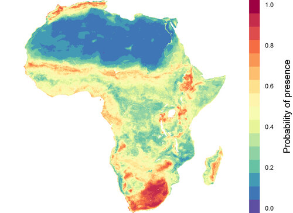

👨‍🎤 Hello! My name is Colin. You can read more about who I am [website](https://www.colinjcarlson.com).

🎓 I'm currently an Assistant Research Professor at Georgetown University, in the [Center for Global Health Science and Security](https://ghss.georgetown.edu/). 

🦠 I also run a program called the [Verena Consortium](https://www.viralemergence.org), a team majority led by early career researchers that predicts the where, when, and how of viral emergence.

🔢 On my Github, you'll find work that uses machine learning and other kinds of data analytics to predict species distributions (like the [embarcadero R package](cjcarlson/embarcadero)), identify the signal of climate change impacts on infectious diseases, or otherwise solve complex problems at the interface between ecology and global health.
